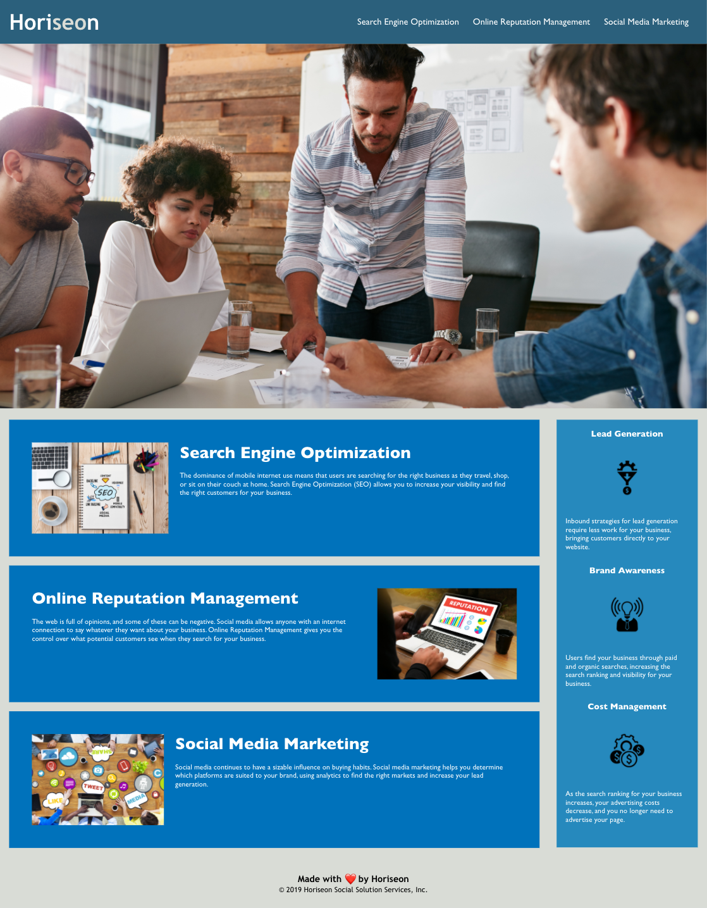

# HORISEON Social Solution Services, inc.
## Description</h2>
The following website is an on-the-job ticket that required me, as a developer, to refract existing code by modifying and consolidating the existing HTML and CSS language and structure, allowing for a more SEO-friendly and accessible website.

Providing web accessibility is extremely important for businesses. Not only does it assist people with disabilities accessing a companies website, it allows for favorable and optimized positioning on search engines such as Google, Bing, and Yahoo.

To increase long-term sustainability, accessilibity, and Search Engine Optimization:

* Updated the HTML semantic language by replacing division elements `
` with HTML5 elements `<header>` `<footer>` `<section>` and `<article>`

* Insured all links are properly formatted

* Properly restructured and formatted the CSS stylesheet

* Consolidated duplicated CSS code by using article classes

* updated header and content with flexbox to all the content to be more responsive on various screen sizes

## Website
https://joshacross.github.io/horiseon-social-solutions-beta/

### Referenced Images

